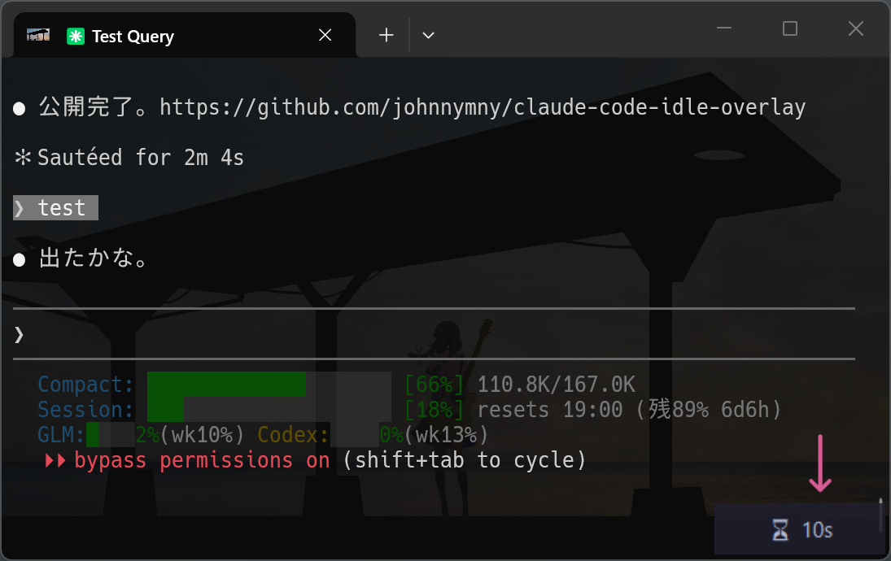

# claude-code-idle-overlay

Claude Codeの応答完了後、ターミナル右下に待機経過時間を表示する小さなオーバーレイ。

[English](README_en.md)



## 課題

Claude Codeを複数ターミナルで並列に使っていると、どのセッションがいつ応答を終えたかがわからない。

## 解決策

応答が完了したターミナルの右下に、半透明のオーバーレイで経過時間を表示する:

```
 ⏳ 2m 15s
```

- 応答が完了したターミナルに正しく表示（フォーカス中のウィンドウではない）
- 次のプロンプト送信で自動消去
- クリックでも閉じられる
- Python標準ライブラリのみ使用（`ctypes`）、追加依存なし
- フォーカスを奪わない（`WS_EX_NOACTIVATE`）

## 要件

- **Windows** (ウィンドウ位置取得にWin32 APIを使用)
- **Python 3.8+** (Windowsの標準Pythonに同梱)
- **Claude Code** (hooks対応)

## インストール

1. Claude Codeのhooksディレクトリにクローン:

```bash
cd ~/.claude/hooks
git clone https://github.com/johnnymny/claude-code-idle-overlay.git idle_overlay
```

2. `~/.claude/settings.json` にフックを追加:

```json
{
  "hooks": {
    "Stop": [
      {
        "hooks": [
          {
            "type": "command",
            "command": "python ~/.claude/hooks/idle_overlay/idle_overlay_stop_hook.py"
          }
        ]
      }
    ],
    "UserPromptSubmit": [
      {
        "hooks": [
          {
            "type": "command",
            "command": "python ~/.claude/hooks/idle_overlay/idle_overlay_prompt_hook.py"
          }
        ]
      }
    ]
  }
}
```

> **Note:** 既にhooksを設定している場合は、既存の配列に新しいエントリを追加してください。

## 仕組み

```
UserPromptSubmit → idle_overlay_prompt_hook.py
                   ├── .idle_overlay_stop_{session_id} を書き込み（既存overlay停止）
                   └── ターミナルウィンドウのrectを .idle_overlay_rect_{session_id} に保存

Stop → idle_overlay_stop_hook.py
       ├── 保存されたrectを読み取り
       └── そのターミナルの右下に idle_overlay.py を起動
```

ポイント: プロンプト送信時はユーザーが必ず正しいターミナルで入力しているため、`GetForegroundWindow()`で正確なウィンドウ位置が取れる。このrectを保存しておき、応答完了時（ユーザーが別のターミナルを見ている可能性がある）に再利用する。

## カスタマイズ

`idle_overlay.py` 先頭の定数を変更:

| 変数 | デフォルト | 説明 |
|------|-----------|------|
| `BG_COLORREF` | `0x2e1e1e` | 背景色 (BGR) |
| `FG_COLORREF` | `0xf4d6cd` | テキスト色 (BGR) |
| `ALPHA_BYTE` | `216` | 不透明度 (0-255) |
| `FONT_NAME` | `"Segoe UI"` | フォント |
| `FONT_SIZE` | `14` | フォントサイズ |
| `COARSE_THRESHOLD` | `300` | この秒数を超えると分単位のみの表示に切替 |
| `MARGIN` | `10` | ウィンドウ端からのマージン (px) |

## 制限事項

- **Windows専用** — Win32 API (`ctypes.windll`) を使用
- **ターミナルマルチプレクサ (tmux, screen):** ペイン単位ではなくターミナルウィンドウ全体の右下に表示される
- **Agent Teams:** Agent Teamsセッション中はオーバーレイを抑制

## ライセンス

MIT
